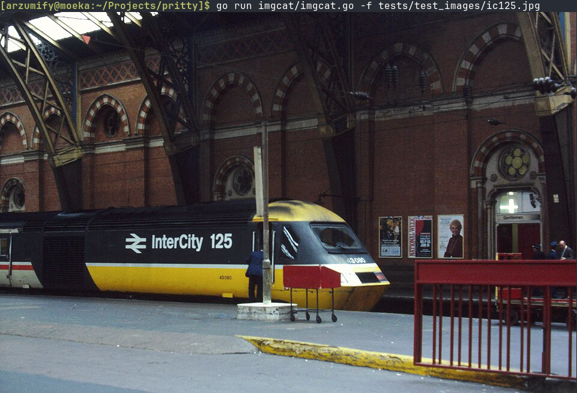

# pritty

Encodes images to iTerm / Kitty / SIXEL (terminal) inline graphics protocols.

## Supported Image Encodings

- **Kitty**
- **iTerm2 / WezTerm**
- **Sixel**

## Compatibility matrix

| terminal | sixel | iTerm2 format | kitty format |
| :---     | :--:  | :--:          | :--:         |
| ghostty  |       |               | Y            |
| iterm2   | Y     | Y             |              |
| kitty    |       |               | Y            |
| rio      | Y     | Y             |              |
| mintty   | Y     | Y             |              |
| mlterm   | Y     | Y             |              |
| putty    |       |               |              |
| rlogin   | Y     | Y             |              |
| wezterm  | Y     | Y             | Y            |
| xterm    | Y     |               |              |

